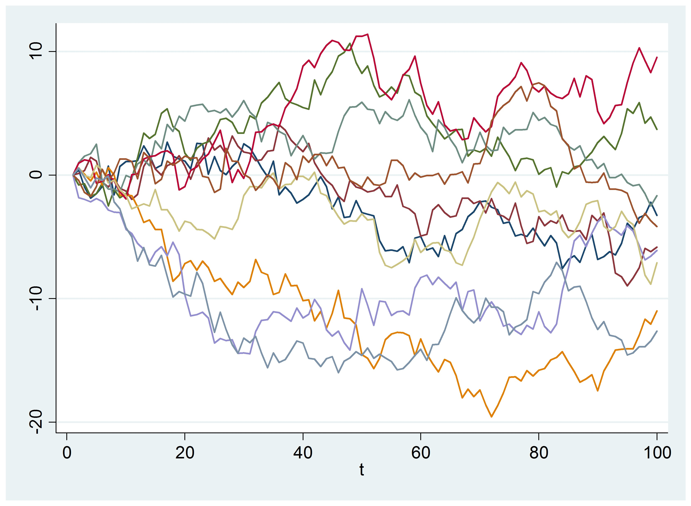

# Stochastic-Differential-Equations

In this repository I will be adding all the code snippets for simulating a number of Stochastic Differential Equations 
using numerical methods and Monte-carlo Simulations.

  

Numerical method concepts involved
1. Euler-Maruyama Method
2. Milstein Method
3. Runge-Kutta Method
4. Taylor Method

Selected research papers
1. [Ornstein-Ulhenbeck process with Non-Gaussian Structure](https://www.researchgate.net/profile/Jakub_Obuchowski/publication/258363832_Ornstein-Uhlenbeck_Process_with_Non-Gaussian_Structure/links/0c96052810e98947d4000000.pdf)
2. [Solving stochastic differential equations andKolmogorov equations by means of deep learning](https://arxiv.org/pdf/1806.00421.pdf)
3. [Numerical Solution ofStochastic Differential Equationsin Finance](http://math.gmu.edu/~tsauer/pre/sde.pdf)

Selected financial topics to be covered (application)
1. Brownian Motion & Stochastic Calculus
2. Black-Scholes Model & Black-Scholes Greeks
3. Exotic Options
4. Implied Volatility & Local-Volatility Fits
5. Stochastic Volatility & Stochastic Control
